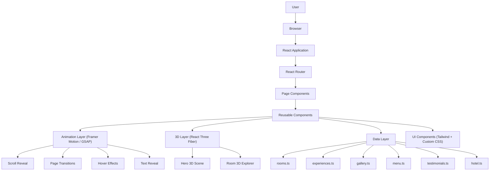
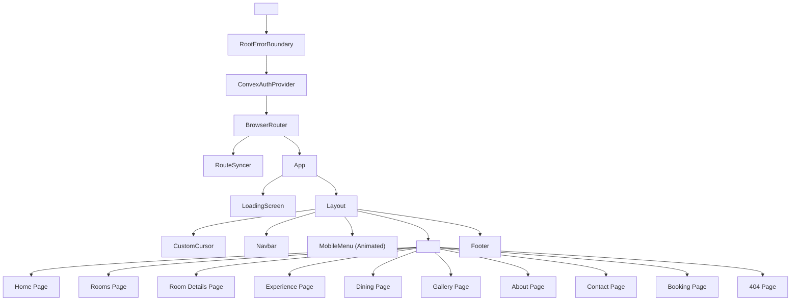
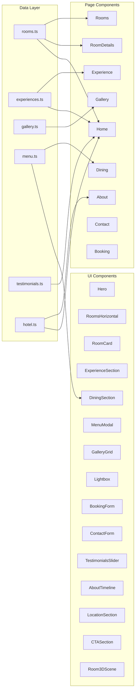
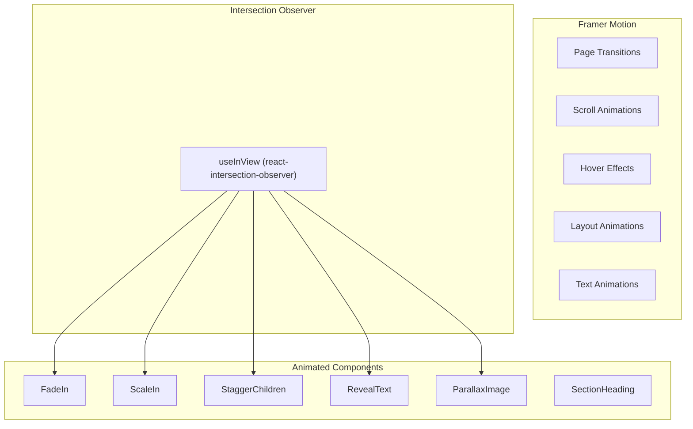
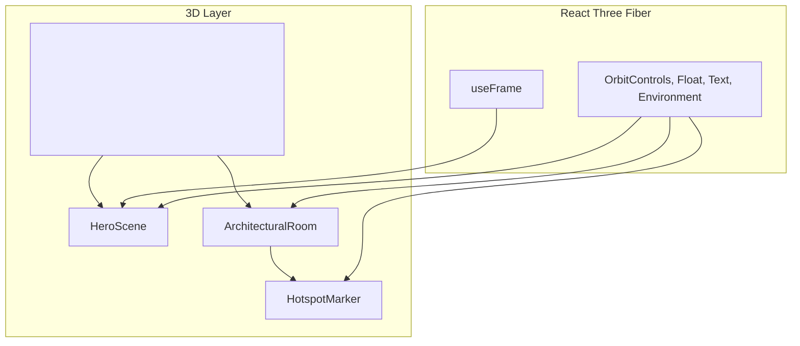

# TECHFLOW_ARCHITECTURE.md — ASSASSIN Hotel

## Application Flow



## Component Hierarchy



## Data Flow



## Routing Architecture

```mermaid
flowchart LR
    "/" --> Home["Home"]
    "/rooms" --> Rooms["Rooms"]
    "/rooms/:slug" --> RoomDetails["RoomDetails"]
    "/experience" --> Experience["Experience"]
    "/dining" --> Dining["Dining"]
    "/gallery" --> Gallery["Gallery"]
    "/about" --> About["About"]
    "/contact" --> Contact["Contact"]
    "/book" --> Booking["Booking"]
    "*" --> NotFound["404"]
```

## Animation Architecture



## 3D Architecture



## Future API Integration

When a backend is added:
1. Replace static data imports with API calls
2. Add Convex queries/mutations for booking
3. Connect contact form to email service
4. Add real-time availability checking
5. Implement user authentication for booking history

## Future Database Integration

- Convex schema for rooms, bookings, contacts
- User accounts and booking history
- Real-time room availability
- Admin dashboard for content management
